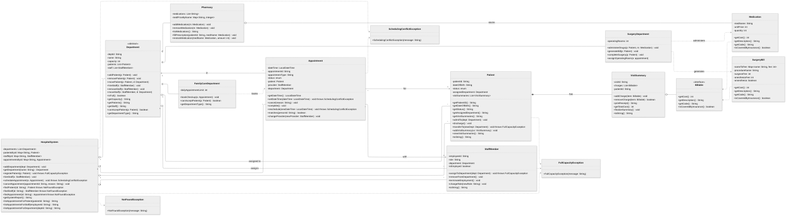

# Hospital-System-CS151-Spring-2026

# Overview

# Design

```mermaid
---
config:
  theme: neutral
  layout: elk
  look: neo
---
classDiagram
direction LR
    class HospitalSystem {
	    -departments: List~Department~
	    -patientsById: Map~String, Patient~
	    -staffById: Map~String, StaffMember~
	    -appointmentsById: Map~String, Appointment~
	    +addDepartment(dept: Department) void
	    +getDepartment(name: String) Department
	    +registerPatient(p: Patient) void throws FullCapacityException
	    +hireStaff(s: StaffMember) void
	    +scheduleAppointment(a: Appointment) void throws SchedulingConflictException
	    +cancelAppointment(appointmentId: String, reason: String) void
	    +findPatient(id: String) Patient throws NotFoundException
	    +findStaff(id: String) StaffMember throws NotFoundException
	    +findAppointment(id: String) Appointment throws NotFoundException
	    +getSystemReport() String
	    +listAppointmentsForPatient(patientId: String) String
	    +listAppointmentsForStaff(employeeId: String) String
	    +listAppointmentsForDepartment(deptId: String) String
    }

    class Department {
	    -deptId: String
	    -name: String
	    -capacity: int
	    -patients: List~Patient~
	    -staff: List~StaffMember~
	    +addPatient(p: Patient) void
	    +removePatient(p: Patient) void
	    +movePatient(p: Patient, d: Department)
	    +hireStaff(s: StaffMember) void
	    +removeStaff(s: StaffMember) void
	    +moveStaff(s: StaffMember, d: Department)
	    +isFull() boolean
	    +getCapacity() String
	    +getPatients() String
	    +getStaff() String
	    +canAcceptPatient(p: Patient) boolean
	    +getDepartmentType() String
    }

    class Pharmacy {
	    -medications: List~String~
	    -medPriceByName: Map~String, Integer~
	    +addMedication(m: Medication) void
	    +removeMedication(m: Medication) void
	    +listMedications() String
	    +fillPrescription(patientId: String, medName: Medication) void
	    +restockMedication(medName: Medication, amount: int) void
    }

    class FamilyCareDepartment {
	    -dailyAppointmentLimit: int
	    +bookCheckup(a: Appointment) void
	    +canAcceptPatient(p: Patient) boolean
	    +getDepartmentType() String
    }

    class SurgeryDepartment {
	    -operatingRooms: int
	    +administerDrugs(p: Patient, m: Medication) void
	    +generateBill(p: Patient) void
	    +completeSurgery(p: Patient) void
	    +assignOperatingRoom(a: appointment)
    }

    class Appointment {
	    -dateTime: LocalDateTime
	    -appointmentId: String
	    -appointmentType: String
	    -status: enum
	    -patient: Patient
	    -provider: StaffMember
	    -department: Department
	    +getDateTime() LocalDateTime
	    +setDateTime(dateTime: LocalDateTime) void throws SchedulingConflictException
	    +cancel(reason: String) void
	    +complete() void
	    +reschedule(newDateTime: LocalDateTime) void throws SchedulingConflictException
	    +matches(personId: String) boolean
	    +changeProvider(newProvider: StaffMember) void
    }

    class Patient {
	    -patientId: String
	    -dateOfBirth: String
	    -status: enum
	    -assignedDepartment: Department
	    -visitSummaries: List~VisitSummary~
	    +getPatientID() String
	    +getDateOfBirth() String
	    +getStatus() String
	    +getAssignedDepartment() String
	    +getVisitSummaries() String
	    +admitTo(dept: Department) void
	    +discharge() void
	    +transferTo(newDept: Department) void throws FullCapacityException
	    +addVisitSummary(vs: VisitSummary) void
	    +viewVisitSummaries() String
	    +toString() String
    }

    class StaffMember {
	    -employeeId: String
	    -role: String
	    -department: Department
	    -isEmployed: boolean
	    +assignToDepartment(dept: Department) void throws FullCapacityException
	    +removeFromDepartment() void
	    +terminateEmployment() void
	    +changeRole(newRole: String) void
	    +toString() String
    }

    class VisitSummary {
	    -visitId: String
	    -charges: List~Billable~
	    -patientId: String
	    +addCharge(item: Billable) void
	    +removeCharge(item: Billable) boolean
	    +printReceipt() String
	    +getTotalCost() int
	    +finalizeSummary() void
	    +toString() String
    }

    class Billable {
	    +getCost() int
	    +getDescription() String
	    +getCode() String
	    +isCoveredByInsurance() boolean
    }

    class Medication {
	    -medName: String
	    -unitPrice: int
	    -quantity: int
	    +getCost() int
	    +getDescription() String
	    +getCode() String
	    +isCoveredByInsurance() boolean
    }

    class SurgeryBill {
	    -nameToFee: Map~name: String, fee: int~
	    -procedureName: String
	    -surgeonFee: int
	    -anesthesiaFee: int
	    -ansesthesia: boolean
	    +getCost() int
	    +getDescription() String
	    +getCode() String
	    +isCoveredByInsurance() boolean
    }

    class FullCapacityException {
	    +FullCapacityException(message: String)
    }

    class SchedulingConflictException {
	    +SchedulingConflictException(message: String)
    }

    class NotFoundException {
	    +NotFoundException(message: String)
    }

	<<abstract>> Department
	<<interface>> Billable

    HospitalSystem "1" o-- "*" Appointment
	HospitalSystem "1" o-- "*" Patient
	HospitalSystem "1" o-- "*" StaffMember
	HospitalSystem "1" o-- "*" Department	
    Department "1" o-- "*" Patient : assigned to
    Department "1" o-- "*" StaffMember : assigns
    Department <|-- Pharmacy
    Department <|-- FamilyCareDepartment
    Department <|-- SurgeryDepartment
	SurgeryDepartment ..> Medication : administers
	SurgeryDepartment ..> SurgeryBill : generates
	FamilyCareDepartment ..> Appointment : books
	Pharmacy o-- Medication : stocks
    Appointment "*" --> "1" Patient : for
	Appointment "*" --> "1" StaffMember : with
	Appointment "*" --> "1" Department : in
    Patient *-- VisitSummary : has
    VisitSummary o-- Billable
    Billable <.. Medication
    Billable <.. SurgeryBill

    HospitalSystem ..> FullCapacityException
    HospitalSystem ..> SchedulingConflictException
    HospitalSystem ..> NotFoundException
    Appointment ..> SchedulingConflictException
    Patient ..> FullCapacityException
    StaffMember ..> FullCapacityException
```
# Installation Instructions

# Usage

# Contributions

