# Hospital-System-CS151-Spring-2026

# Overview

This project is a Hospital management system containing distinct classes that function together through object oriented design principles. There are 3 department types, Surgery, Family Care, and Pharmacy, which are inherited from the abstract Department class. Patients are also registered, admitted and transferred from departments, while also being discharged. From a management point of view, staff members of the hospital can be hired, removed, and assigned to different departments of the hospital. Appointments can be scheduled, rescheduled, completed, and cancelled too. 

The 3 Exceptions are handled are
-FullCapacityException, which is thrown when the system reaches its maximum capacity.
-NotFoundException, which is thrown when something in the system can't be found by the ID.
-SchedulingConflictException, which is thrown when scheduling an appointment, there is already
another booking at the same date and time.


The billable interface is implemented through Medication and surgeryBill, utilizing polymorphism to store different forms of charges such as insurance costs and surgery costs. Anesthesia is also taken into consideration for surgery costs as well as if insurance is offered depending on costs. System Report on the Main menu can showcase high level overview of data collection. 

Exit functionality is handled through readString() and readInt():


-readString() checks for exit every time the program asks the user for a text input.


-readInt() checks for exit every time the program asks the user for a number.


# Design

```mermaid
classDiagram
direction LR
    class HospitalSystem {
	    -departments: List~Department~
	    -patientsById: Map~String, Patient~
	    -staffById: Map~String, StaffMember~
	    -appointmentsById: Map~String, Appointment~
	    +addDepartment(dept: Department) void
	    +getDepartment(name: String) Department
	    +registerPatient(p: Patient) void throws FullCapacityException
	    +hireStaff(s: StaffMember) void
	    +scheduleAppointment(a: Appointment) void throws SchedulingConflictException
	    +cancelAppointment(appointmentId: String, reason: String) void
	    +findPatient(id: String) Patient throws NotFoundException
	    +findStaff(id: String) StaffMember throws NotFoundException
	    +findAppointment(id: String) Appointment throws NotFoundException
	    +getSystemReport() String
	    +listAppointmentsForPatient(patientId: String) String
	    +listAppointmentsForStaff(employeeId: String) String
	    +listAppointmentsForDepartment(deptId: String) String
    }

    class Department {
	    -deptId: String
	    -name: String
	    -capacity: int
	    -patients: List~Patient~
	    -staff: List~StaffMember~
	    +getDeptId() String
	    +setDeptId(deptId: String) void
	    +getName() String
	    +setName(name: String) void
	    +getCapacity() int
	    +setCapacity(capacity: int) void
	    +getPatients() List~Patient~
	    +getStaff() List~StaffMember~
	    +addPatient(p: Patient) void
	    +removePatient(p: Patient) void
	    +movePatient(p: Patient, d: Department) void
	    +hireStaff(s: StaffMember) void
	    +removeStaff(s: StaffMember) void
	    +moveStaff(s: StaffMember, d: Department) void
	    +isFull() boolean
	    +canAcceptPatient(p: Patient) boolean
	    +getDepartmentType() String
	    +toString() String
    }

    class Pharmacy {
	    -medications: List~String~
	    -medPriceByName: Map~String, Integer~
	    +addMedication(m: Medication) void
	    +removeMedication(m: Medication) void
	    +listMedications() String
	    +fillPrescription(patientId: String, medName: Medication) void
	    +restockMedication(medName: Medication, amount: int) void
    }

    class FamilyCareDepartment {
	    -dailyAppointmentLimit: int
	    +bookCheckup(a: Appointment) void
	    +canAcceptPatient(p: Patient) boolean
	    +getDepartmentType() String
    }

    class SurgeryDepartment {
	    -operatingRooms: int
	    +administerDrugs(p: Patient, m: Medication) void
	    +generateBill(p: Patient) void
	    +completeSurgery(p: Patient) void
	    +assignOperatingRoom(a: appointment)
    }

    class Appointment {
	    -dateTime: LocalDateTime
	    -appointmentId: String
	    -appointmentType: String
	    -status: enum
	    -patient: Patient
	    -provider: StaffMember
	    -department: Department
	    +getDateTime() LocalDateTime
	    +setDateTime(dateTime: LocalDateTime) void throws SchedulingConflictException
	    +cancel(reason: String) void
	    +complete() void
	    +reschedule(newDateTime: LocalDateTime) void throws SchedulingConflictException
	    +matches(personId: String) boolean
	    +changeProvider(newProvider: StaffMember) void
    }

    class Patient {
	    -patientId: String
	    -dateOfBirth: String
	    -status: PatientStatus
	    -assignedDepartment: Department
	    -visitSummaries: List~VisitSummary~
	    +getPatientId() String
	    +setPatientId(patientId: String) void
	    +getDateOfBirth() String
	    +setDateOfBirth(dateOfBirth: String) void
	    +getStatus() PatientStatus
	    +setStatus(status: PatientStatus) void
	    +getAssignedDepartment() Department
	    +setAssignedDepartment(assignedDepartment: Department) void
	    +getVisitSummaries() List~VisitSummary~
	    +setVisitSummaries(visitSummaries: List~VisitSummary~) void
	    +admitTo(dept: Department) void
	    +discharge() void
	    +transferTo(newDept: Department) void throws FullCapacityException
	    +addVisitSummary(vs: VisitSummary) void
	    +viewVisitSummaries() String
	    +toString() String
    }

    class PatientStatus {
	    <<enumeration>>
	    REGISTERED
	    ADMITTED
	    TRANSFERRED
	    DISCHARGED
    }

    class StaffMember {
	    -employeeId: String
	    -role: String
	    -department: Department
	    -isEmployed: boolean
	    +assignToDepartment(dept: Department) void throws FullCapacityException
	    +removeFromDepartment() void
	    +terminateEmployment() void
	    +changeRole(newRole: String) void
	    +toString() String
    }

    class VisitSummary {
	    -visitId: String
	    -charges: List~Billable~
	    -patientId: String
	    +addCharge(item: Billable) void
	    +removeCharge(item: Billable) boolean
	    +printReceipt() String
	    +getTotalCost() int
	    +finalizeSummary() void
	    +toString() String
    }

    class Billable {
	    +getCost() int
	    +getDescription() String
	    +getCode() String
	    +isCoveredByInsurance() boolean
    }

    class Medication {
	    -medName: String
	    -unitPrice: int
	    -quantity: int
	    +getCost() int
	    +getDescription() String
	    +getCode() String
	    +isCoveredByInsurance() boolean
    }

    class SurgeryBill {
	    -nameToFee: Map~name: String, fee: int~
	    -procedureName: String
	    -surgeonFee: int
	    -anesthesiaFee: int
	    -ansesthesia: boolean
	    +getCost() int
	    +getDescription() String
	    +getCode() String
	    +isCoveredByInsurance() boolean
    }

    class FullCapacityException {
	    +FullCapacityException(message: String)
    }

    class SchedulingConflictException {
	    +SchedulingConflictException(message: String)
    }

    class NotFoundException {
	    +NotFoundException(message: String)
    }

	<<abstract>> Department
	<<interface>> Billable

    HospitalSystem "1" o-- "*" Appointment
	HospitalSystem "1" o-- "*" Patient
	HospitalSystem "1" o-- "*" StaffMember
	HospitalSystem "1" o-- "*" Department
    Department "1" o-- "*" Patient : assigned to
    Department "1" o-- "*" StaffMember : assigns
    Department <|-- Pharmacy
    Department <|-- FamilyCareDepartment
    Department <|-- SurgeryDepartment
	SurgeryDepartment ..> Medication : administers
	SurgeryDepartment ..> SurgeryBill : generates
	FamilyCareDepartment ..> Appointment : books
	Pharmacy o-- Medication : stocks
    Appointment "*" --> "1" Patient : for
	Appointment "*" --> "1" StaffMember : with
	Appointment "*" --> "1" Department : in
    Patient *-- VisitSummary : has
    Patient --> PatientStatus
	Patient --> Department
    VisitSummary o-- Billable
    Billable <.. Medication
    Billable <.. SurgeryBill

    HospitalSystem ..> FullCapacityException
    HospitalSystem ..> SchedulingConflictException
    HospitalSystem ..> NotFoundException
    Appointment ..> SchedulingConflictException
    Patient ..> FullCapacityException
    StaffMember ..> FullCapacityException
```


# Installation Instructions

1. Clone the repository on GitHub:

```bash
git clone https://github.com/Hadondish/Hospital-System-CS151-Spring-2026.git
```

2. Navigate into the project directory:

```bash
cd Hospital-System-CS151-Spring-2026
```

3. Compile the Java source files:

```bash
javac hospital/*.java
```


# Usage

Start by compiling all files with:


// Compile files

javac hospital/*.java 

// Run the main terminal

java hospital.HospitalTerminal

Once presented with main menu, run workflows.


══════════════ MAIN MENU ══════════
 1. Department Management
 2. Patient Management
 3. Staff Management
 4. Appointment Management
 5. Pharmacy Management
 6. System Report
 0. Exit

    
══════════════════════════════════

Example Workflows:

Scheduling an Appointment


Click 4.

Click 1. Schedule Appointment

Enter Appointment ID,
Type,
Data,
Patient ID,
Provider ID,
Department.


Rescheduling an Appointment
Click 4
Click 5. Reschedule Appointment

VisitSummary
Click on 2. Patient Management
Click on 6. Add Visit Summary
Enter Patient ID,
Visit ID,
Add correct medical charges

Declare Yes or No if there was anesthesia involved in the surgery or not

Find History of System Report
Click 6. System Report from main menu


--------------------------------------

ID Terminologies


ID are 4 character strings in length, starting with the first letter of description, then followed by numerical values.

Patient ID: Starts with P, example - (P001, P002, etc)
Department ID: Starts with D, example - (D001, D002, etc)
Appointment ID: Starts with A, example - (A001, A002, etc)
Employee ID: Starts with E, example - (E001, E002, etc).

Departments are 
Surgery, Family Care, and Pharmacy for example.

Medications are the name of medication, such as Ibuprofen.

# Contributions
- Jhomar Luna: HospitalSystem Class, Appointment Class, StaffMember Class
- Thao Huynh: Department Abstract Class, Patient Class
- Kevin Tran: VisitSummary Class, Billable Interface, SurgeryBill Class, Medication Class, Hospital Terminal (User Interface)
- Zahid Khan: SurgeryDepartment Class, FamilyCare Department Class, Pharmacy Class
